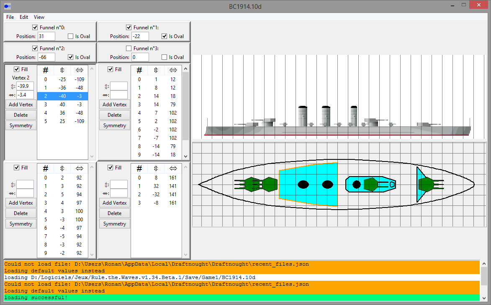

# Draftnought
Editor for the top-view of the ships from the game Rule The Waves

## Use:
#### With the compiled releases:
start draftnought.exe

#### With python:
start main.py

#### First start
  

  Use the "load ship file" or the menu option File => Open File, or the shortcut Ctrl-O to open a .<xy>d file.
  They can be found in your game folder, under /Save/Game<x>/
  
  
  
#### After loading
  
  Draw all the things! You can pan the side and top views by holding the mouse's left button and dragging and you can zoom with the mouse's scroll wheel. To help align the superstructures and funnels, a grid can be toggled under the Menu => View => Grid.
  
  You can move the vertexes of the superstructures by selecting them in the lists and editing their coordinates or clicking on the top view.
  The funnels can be toggled on/off, oval/round and placed by clicking on the top view or editing their coordinate.
  
  The coordinate system is:
  - origin in the middle of the ship
  - first coordinates along the axis bow-stern, increasing toward the stern
  - second coordinates along port-starboard, increasing toward starboard
  
  Don't forget to save! The last saved file is automatically loaded on the next start.

## Requirements to build
  Python>=3.6
  Windows 7+ for the build batch file
  Tested on win 8.1, nothing else.

## Build:
run build.bat

## Limitations and TODO list
  - probable presence of bugs in the turret position logic
  - only one style of turrets, so the turret's outlines will not be exactly what you see in the game
  - secondaries are not shown
  - turrets positions, ship lengths are inaccurate
